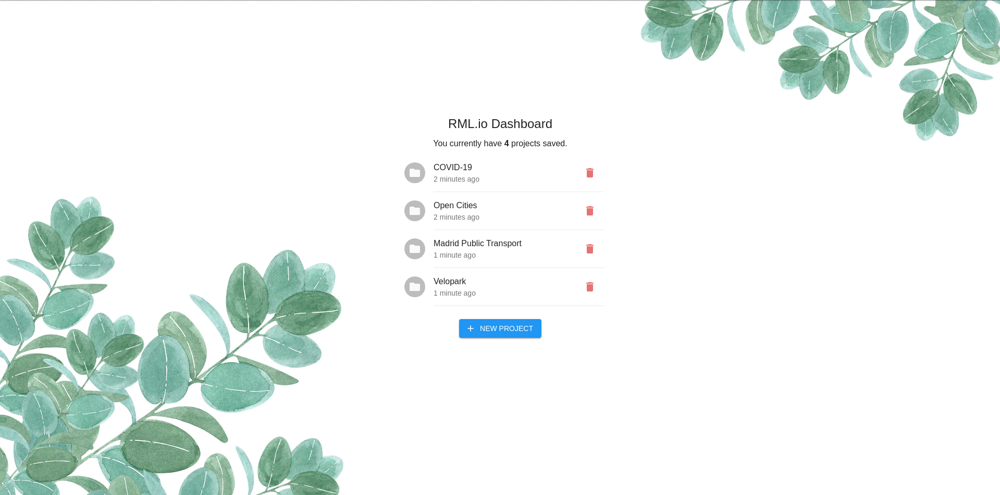
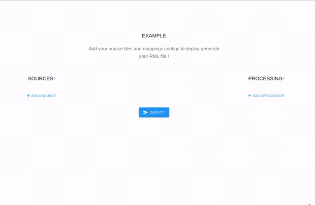

<b>RML.io Dashboard</b>

Web application which allows you to use <a href="https://rml.io/">RML.io</a> to generate high-quality Linked Data, in order to create
knowledge graphs

---

## Generation of the RML file

First, you need to create or load a project:

Once you get into your project, you have three points to
respect, in an arbitrary order:

1. add your source file(s): input file(s) and/or RML file(s);
2. add your processor(s) by specifying:
   - its type of the RML file (e.g. N-Quads, TriG, Turtle);
   - its mapping configuration (generated from [Matey](https://rml.io/yarrrml/matey/)).
3. click on deploy and pick your deployment preferences (run your workspace and/or download it).

**NOTE:** a source file can be linked to `1` or `n` processors.

## Getting Started

Start by cloning the repository:

    git clone https://github.com/oSoc20/rml-workbench-front-end

Next, let's install the dependencies:

    yarn install

Finally, launch the web server:

    yarn start

The website is now available locally on `http://localhost:3000`!

**NOTE:** for ease of development, [the backend](https://github.com/oSoc20/rml-workbench-back-end)
is available on another repository.

## Use-cases

A set of [use cases of knowledge graphs](https://github.com/kg-construct/use-cases) is available so
that you can have a better global vision of the panel of possibilities that is provided to you.

## Vocabulary

The following is a non-exhaustive list of commonly used vocabulary:

<dl>
  <dt>Processor</dt>
  <dd>Generates a target according to a mapping config.</dd>

  <dt>Source</dt>
  <dd>An input file (e.g. CSV, JSON, XML) or an RML file (e.g. N-Quads, TriG, Turtle).</dd>

  <dt>Target</dt>
  <dd>A RML file (e.g. N-Quads, TriG, Turtle).</dd>
</dl>

## FAQ

### What's knowledge graphs?

A knowledge graph acquires and integrates information into an ontology and applies a reasoner to
derive new knowledge. With a knowledge graph, a machine machine can easily understand and extract
the information.

### Where knowledge graphs are used?

Knowledge graphs are often used in various areas of machine learning (ML), natural language
processing (NLP) and search.

## License

Code is under the [MIT License](https://github.com/oSoc20/rml-workbench-front-end/blob/master/LICENSE).
